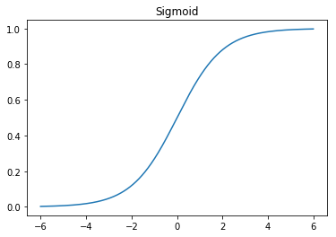
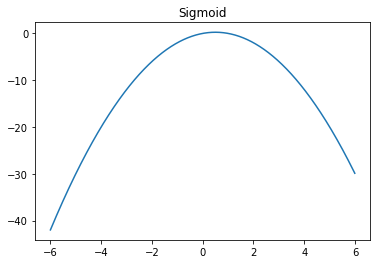
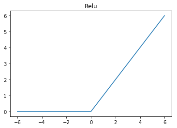
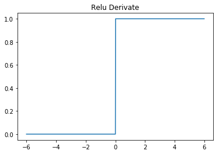

# Numpy

We're going to do a bit of math in few dimensions.
That said we should use a toolset that does that just well. Numpy

```python
import numpy as np
```

# Activation function

A function that decides if a neuron should be activated or not
Sigmond used to be a standard but nowdays relu took over?


```python
def sigmoid(x, derivate=False):
    if not derivate:
        return 1.0/(1+ np.exp(-x))
    else:
        return x * (1.0 - x)

def relu(x, derivate=False):
    if not derivate:
        return np.maximum(x, 0)
    else:
        return np.greater(x, 0).astype(int)
```

# The Brain!
Well, almost. Stupid and artifical

```python
class NeuralNetwork:
    def __init__(self, input, res):
        self.input      = input
        self.res        = res
        self.weights1   = np.random.rand(self.input.shape[1],4) 
        self.weights2   = np.random.rand(4,1)                 
        self.output     = np.zeros(y.shape)
        
    def feedforward(self):
        self.layer1 = sigmoid(np.dot(self.input, self.weights1))
        self.output = sigmoid(np.dot(self.layer1, self.weights2))
        
    def backpropagation(self):
        derived_weights2 = np.dot(self.layer1.T, (2*(self.res - self.output) * sigmoid(self.output, True)))
        derived_weights1 = np.dot(self.input.T,  (np.dot(2*(self.res - self.output) * sigmoid(self.output, True), self.weights2.T) * sigmoid(self.layer1, True)))
        
        self.weights1 += derived_weights1
        self.weights2 += derived_weights2
```

# Training/Learning
Let's try to teach the network that for the input of 0011 the answer is 0
The Neuronet should just get that


```python
X = np.array([[0,0,1,1],
              [0,1,1,0],
              [1,0,1,1],
              [1,1,1,0]])
y = np.array([[0],[1],[1],[0]])
neural_net = NeuralNetwork(X,y)

for i in range(1500):
    neural_net.feedforward()
    neural_net.backpropagation()

print(neural_net.output)
```

## The answers!

The neuronet just got that!

    [[0.00930976]
     [0.97453687]
     [0.97452596]
     [0.02892225]]


# Not part of the Neural Net

I am just interested to see here a plot of the math functions I am using here and some playground for other math functions


```python
import matplotlib.pyplot as plt  
import numpy as np

def show_func(func, derivate=False, title=None):
    x = np.arange(-6, 6, 0.01)
    y = func(x, derivate)
    plt.title(title)
    plt.plot(x, y)
    plt.show()
```


```python
show_func(sigmoid, False, 'Sigmoid')
```





```python
show_func(sigmoid, True, 'Sigmoid')
```





```python
show_func(relu, False, 'Relu')
```





```python
show_func(relu, True, 'Relu Derivate')
```




